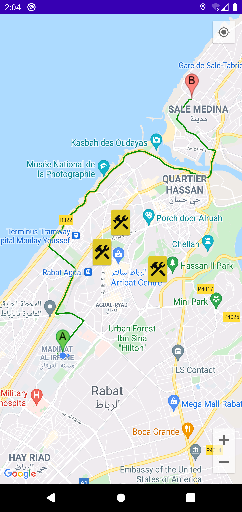
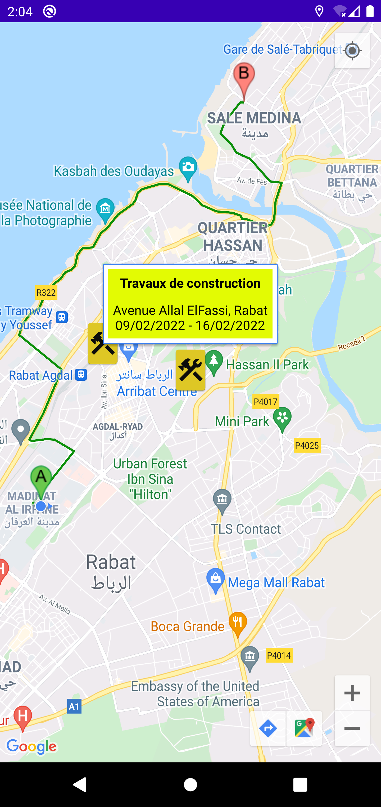
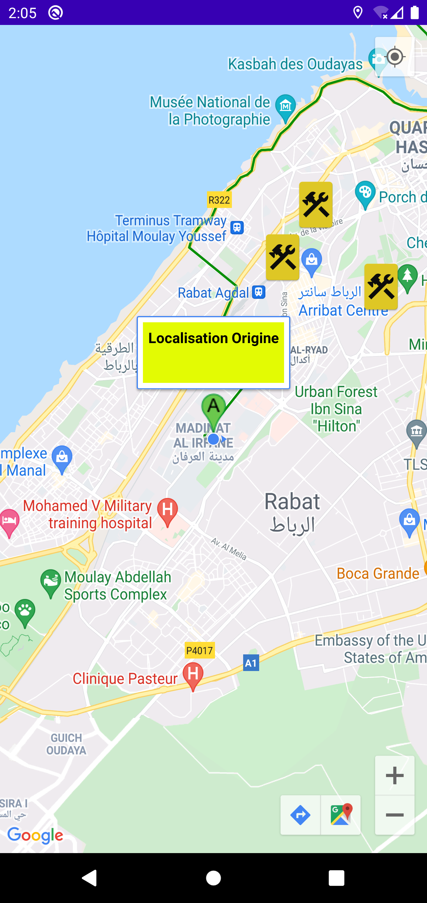
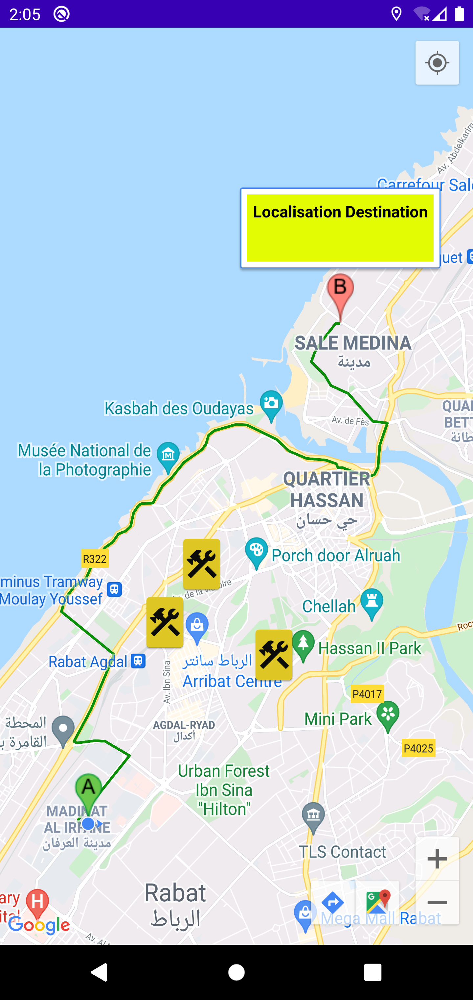

# Avoid Construction Works On Road by Google Maps

This project is about how to avoid construction work places when we move from a origin place to a destination place by taking the direction where we will not meet the works. This project is carried out within the framework of a mobile application developed in Java and an SQLite database while using the Google Maps and Google Directions APIs as well.

    

    

